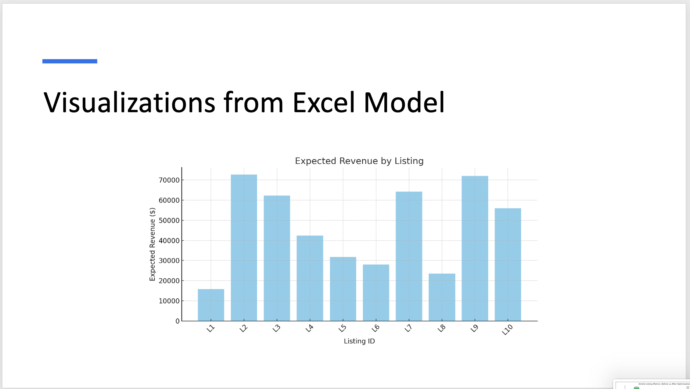
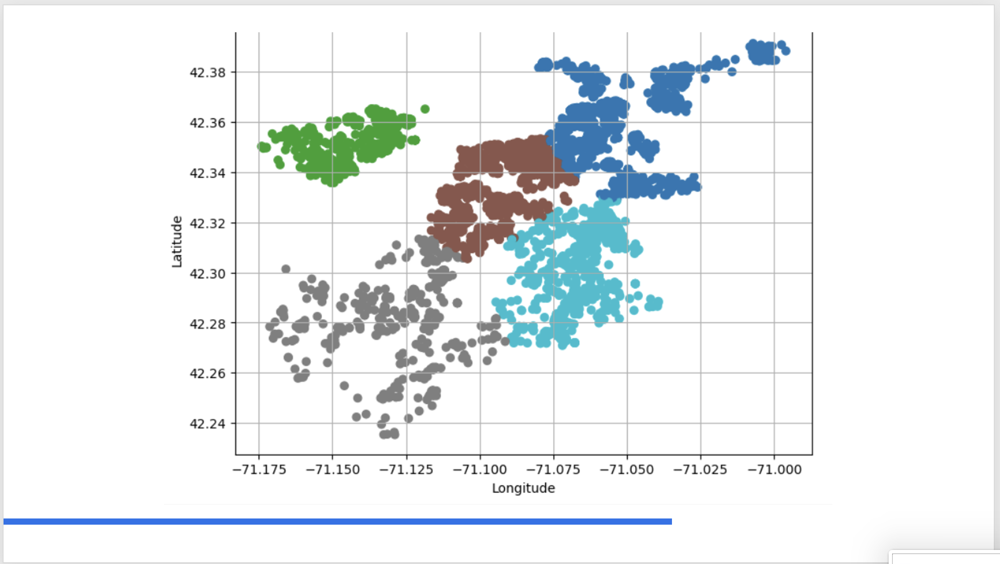

# Optimizing Pricing Strategy in Boston – Retail Analytics  

📊 **Course:** BIA-650  
👩‍💻 **Team:** Shubham Kore, Rohini Mallikarjunaiah, Cheyenne Manning, Napaphach Limsupthana  
🛠 **Tools:** Excel Solver (Simplex LP) | Tableau | Python | Feature Engineering  

---

## 🔍 Project Overview  
Airbnb hosts in Boston often set prices by guesswork.  
This project applied **linear programming (LP) using Excel Solver** to optimize Airbnb pricing for 10 real listings in Boston.  
The goal was to **maximize total expected revenue** under real-world pricing constraints.

---

## 🎯 Objectives  
- Identify factors driving Airbnb revenue performance  
- Use **Excel Solver (Simplex LP)** to find optimal listing prices  
- Build KPIs and insights for host decision-making  

---

## 🧮 Optimization Setup  
| Component | Description |
|------------|-------------|
| **Type** | Linear Programming (LP) |
| **Tool** | Excel Solver – Simplex LP Method |
| **Objective Function** | Maximize Σ(Adjusted Price × Occupancy Rate × Available Days) |
| **Decision Variable** | Adjusted Price ($) for each listing |
| **Constraints** | 50 ≤ Price ≤ 300 |
| **Inputs** | Fixed Occupancy Rate (%) and Availability (Days) |

---

## 🧠 Data Preparation & Feature Engineering  
- **Revenue per Day = Revenue / Days Available**  
- **Occupancy-Weighted Price = Adjusted Price × Occupancy Rate**  
- **% Revenue Contribution = Revenue / Total Revenue**  
- Solver Target → Total Revenue (G13)  
- Variable Range → E2:E11  
- Solved with Simplex LP method  

---

## 📈 Key Insights & Results  
- All listings hit the upper price bound ($300) → high market demand supports premium pricing  
- **Dorchester** listings earned less due to low occupancy despite similar prices  
- **Revenue per Day** and **Occupancy-Weighted Price** are stronger metrics than total revenue  
- Solver had **no binding constraints** → model is scalable to larger datasets  
- **High availability + high occupancy** listings outperform location-based pricing  

---

## 🗺️ Visualization Highlights  
- Occupancy Rate by Neighborhood  
- Revenue per Listing and per Day  
- Neighborhood Performance Heatmaps  
- Cluster Analysis → Back Bay / Fenway / Downtown (high) vs. Roxbury / East Boston (moderate)

---

## ⚠️ Limitations  
- Sample limited to 10 listings  
- Static occupancy rates (not dynamic)  
- Revenue only → no cost or profit analysis  
- No seasonality (e.g., holidays or university calendar effects)

---

## 🚀 Future Enhancements  
- Predict occupancy using regression or ML models  
- Add seasonal and profitability factors (cleaning fees, platform fees, city costs)  
- Expand framework to other cities for comparison  

---

## 🧩 Learning Outcomes  
- Applied Linear Programming to a real pricing problem  
- Learned how constraints impact optimal solutions  
- Improved data storytelling through visual dashboards  

---

## 📸 Dashboard Preview

> The dashboards visualize the optimization results from Excel Solver,
> comparing revenue per listing, neighborhood performance, and price elasticity across Boston.

